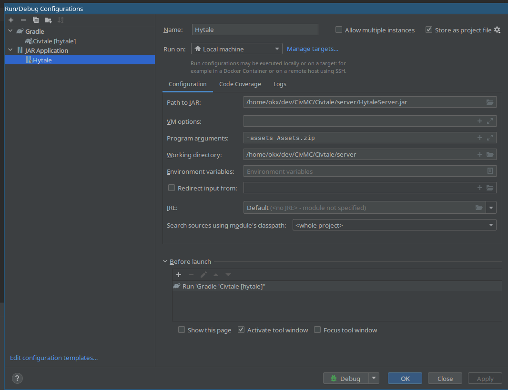
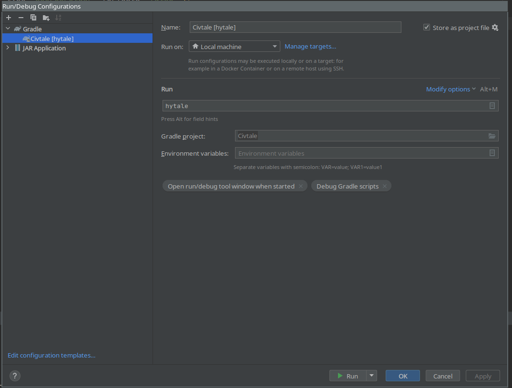

# Getting started

To setup the development environment, you need either Windows or Linux, as well as Python and Java 21+ installed.

Run `python3 setup.py` to download the Hytale jar, setup a server, and decompile it.

You wil find it will put a server in the `server` folder, and sources in the `source` folder. If you are using IntelliJ, mark `source` as "Generated Sources Root", and then attach it as a source to the hytale jar (click "Attach Sources" when viewing a decompiled class)

To run Hytale in debugging mode, it's recommended to make a configuration in IntelliJ like so:




Recommended arguments for running the jar:

```
--assets Assets.zip --assets ../Assets --disable-sentry --allow-op
```

Running the jar application in debug mode will compile the plugin and run the server.
